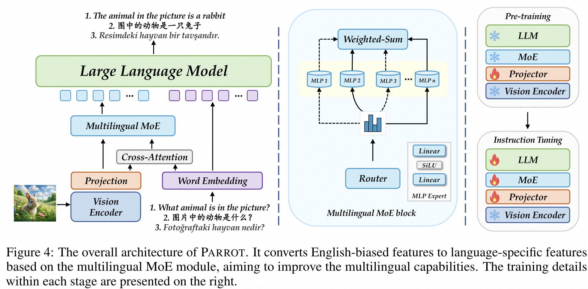
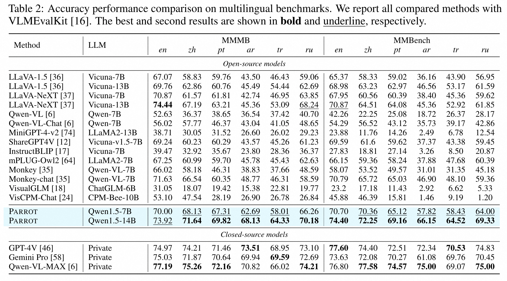
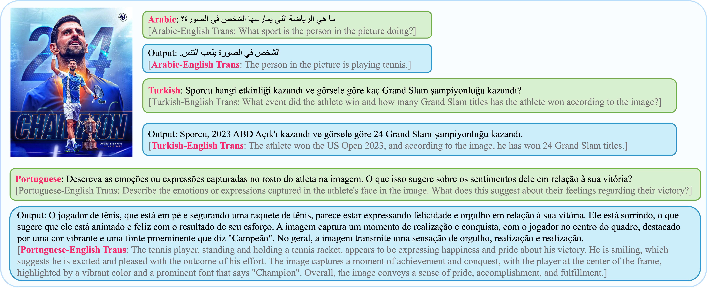

# 🦜 Parrot: Multilingual Visual Instruction Tuning

<p align="center">
  <a href="#-introduction">🎉Introduction</a> •
  <a href="#-whats-new">📰What's New</a> •
  <a href="#%EF%B8%8F-install">☄️Install</a> •
  <a href="#-model">🦜Model</a> •
  <a href="#-train">🔥Train</a> •
  <a href="#-datasets">🌟Datasets</a> •
  <a href="#-mmmb">🎄MMMB</a> <br />
  <a href="#-evaluation">🔑Evaluation</a> •
  <a href="#-quick-start">📍Quick Start</a> •
  <a href="#-acknowledgement">👨‍🏫Acknowledgement</a> •  
  <a href="#-contact">🤗Contact</a>
</p>

---

<p align="center">
  <a href=""></a>
  <a href='https://sun-hailong.github.io/projects/Parrot'></a>
  <a href='https://arxiv.org/abs/2406.02539'></a>
  <a href=""></a>
  <a href=""></a>
</p>

> Thanks to [Hai-Long Sun](https://github.com/sun-hailong) for his contribution in Parrot!

## 🎉 Introduction
Welcome to Parrot [[paper](https://arxiv.org/abs/2406.02539)], a novel method that utilizes textual guidance to drive visual token alignment at the language level. Parrot makes the visual tokens condition on diverse language inputs and uses Mixture-of-Experts (MoE) to promote the alignment of multilingual tokens. Moreover, considering the current lack of benchmarks for evaluating multilingual capabilities within the field, we collect and make available a Massive Multilingual Multimodal Benchmark which includes 6 languages, 15 categories, and 12,000 questions, named as MMMB.

**If you find Parrot useful for your research and applications, please cite using this BibTeX:**
```bibtex
@article{sun2024parrot,
  title={Parrot: Multilingual Visual Instruction Tuning},
  author={Sun, Hai-Long and Zhou, Da-Wei and Li, Yang and Lu, Shiyin and Yi, Chao and Chen, Qing-Guo and Xu, Zhao and Luo, Weihua and Zhang, Kaifu and Zhan, De-Chuan and others},
  journal={arXiv preprint arXiv:2406.02539},
  year={2024}
}
```

## 📰 What's New
- [08/21] 🔥 We have supported our multilingual MLLM **Parrot** in [VLMEvalKit](https://github.com/open-compass/VLMEvalKit), now you can evaluate Parrot easily. Welcome to have a try!
- [08/20] 🔥 We have supported **MMMB and Multilingual MMBench** in [VLMEvalKit](https://github.com/open-compass/VLMEvalKit), now you can use the name `MMMB` and `MTL_MMBench_DEV` to obtain the results of 6 langs at the a time. Welcome to have a try!
- [08/02] 🔥 We release the [code](https://github.com/AIDC-AI/Parrot), inhouse multilingual [dataset](https://huggingface.co/datasets/AIDC-AI/Parrot-dataset/tree/main/sharegpt_4v), benchmark [MMMB](https://huggingface.co/datasets/AIDC-AI/Parrot-dataset/tree/main/mmmb), and [model](https://huggingface.co/AIDC-AI/Parrot-7B), welcome to have a try!
- [06/05] 🔥 Parrot is coming! We release the [paper](https://arxiv.org/abs/2406.02539)!


## ☄️ Install

Please follow the instructions below to install the required packages.

1. Clone this repository and navigate to Parrot folder
```bash
git clone https://github.com/AIDC-AI/Parrot.git
cd Parrot
```

2. Install Package
```Shell
conda create -n parrot python=3.10 -y
conda activate parrot
pip install --upgrade pip
pip install -e .
```

### Upgrade to latest code base

```Shell
git pull
pip install -e . --no-deps
```

## 🦜 Model
Parrot is a multilingual multimodal large language model. We provide our fully finetuned models below:

| Model | Base LLM | Vision Encoder | Stage | Download |
| --- | --- | :---: | :---: | :---: |
| Parrot-7B | Qwen-1.5-7B-Chat | CLIP-ViT-Large-patch14-336 | SFT | [ckpt](https://huggingface.co/AIDC-AI/Parrot-7B) |
| Parrot-14B | Qwen-1.5-14B-Chat | CLIP-ViT-Large-patch14-336 | SFT | [ckpt](https://huggingface.co/AIDC-AI/Parrot-14B) |

<div align="center">
  
</div>

## 🔥 Train

Parrot is trained in two stages: modality alignment and instruction tuning for multilingual alignment. Each stage's training script is provided in the `scripts` folder. Before starting the training, ensure you properly set the `ROOT` variable in the training script. Below are the commands to train Parrot for each stage:

```shell
bash scripts/train/pretrain.sh
bash scripts/train/finetune.sh
```

#### Hyperparameters
We use a similar set of hyperparameters as Vicuna in finetuning.  Both hyperparameters used in pretraining and finetuning are provided below.

1. Pretraining

| Model | Global Batch Size | Learning rate | Epochs | Max length | Weight decay |
| --- | ---: | ---: | ---: | ---: | ---: |
| Parrot-7B | 256 | 1e-3 | 1 | 2048 | 0 |

2. Finetuning

| Model | Global Batch Size | Learning rate | Epochs | Max length | Weight decay |
| --- | ---: | ---: | ---: | ---: | ---: |
| Parrot-7B | 128 | 2e-5 | 1 | 2048 | 0 |

#### Download Qwen1.5-7B-Chat checkpoints

Our base model Qwen1.5-7B-Chat, which is an instruction-tuned chatbot, can be downloaded from [here](https://huggingface.co/Qwen/Qwen1.5-7B-Chat).

## 🔎 Datasets

All training datasets are summarized in the Python file located at `parrot/train/utils/utils.py`. Each dataset contains a collection of samples where each sample consists of text and (optionally) image. The text data is embedded directly within the JSON file, while the image is represented by its filename. This filename refers to the image file located in the `image_dir`.

We provide the JSON file for each training dataset at [Huggingface](https://huggingface.co/datasets/AIDC-AI/Parrot-dataset/tree/main/sharegpt_4v). The images can be downloaded from their respective sources listed below.

| dataset name                   |      image dir |                                                  image source |
|:-------------------------------|---------------:|--------------------------------------------------------------:|
| llava-pretrain-558k            | llava_pretrain |     https://huggingface.co/datasets/liuhaotian/LLaVA-Pretrain |
| laion-12k            | parrot_laion |     https://huggingface.co/datasets/AIDC-AI/Parrot-dataset |
| cc12m-645k           | parrot_cc12m |          https://huggingface.co/datasets/AIDC-AI/Parrot-dataset |
| llava-finetune-665k            | llava_finetune |      https://github.com/haotian-liu/LLaVA |
| sharegpt4v-sft-zh           |     multilingual_sft |          https://huggingface.co/datasets/AIDC-AI/Parrot-dataset/tree/main/sharegpt_4v |
| sharegpt4v-sft-pt           |     multilingual_sft |          https://huggingface.co/datasets/AIDC-AI/Parrot-dataset/tree/main/sharegpt_4v |
| sharegpt4v-sft-ar           |     multilingual_sft |          https://huggingface.co/datasets/AIDC-AI/Parrot-dataset/tree/main/sharegpt_4v |
| sharegpt4v-sft-tr           |     multilingual_sft |          https://huggingface.co/datasets/AIDC-AI/Parrot-dataset/tree/main/sharegpt_4v |
| sharegpt4v-sft-ru           |     multilingual_sft |          https://huggingface.co/datasets/AIDC-AI/Parrot-dataset/tree/main/sharegpt_4v |

Below is an example of the folder structure. You can alter the folder structure as needed and modify the function `name2data` in `parrot/train/utils/utils.py` accordingly.
```
|-- mllm_datasets
    |-- meta_files
        |-- llava-pretrain-558k.json
        |-- laion-12k.json
        |-- llava-finetune-665k.json
        ...
    |-- images
        |-- llava_pretrain
        |-- sharegpt4v
        |-- laion
        ...
```

## 🎄 MMMB

We provide the MMMB benchmark at [Huggingface](https://huggingface.co/datasets/AIDC-AI/Parrot-dataset/tree/main/mmmb). It contains 6 languages, 15 categories, and 12,000 questions (Following the company's data review, it was identified that some of the data might contain non-compliant information, which could result in the total number of entries in the dataset being slightly fewer than 2,000.) You can download the dataset and use it for your own experiments. We utilize the tsv file to store the dataset, and it is easy to evaluate using the `VLMEvalKit`.

<div align="center">
  
</div>

## 🔑 Evaluation

> We use the [VLMEvalKit](https://github.com/open-compass/VLMEvalKit) to evaluate MLLMs.

To evaluate the multilingual capabilities of Parrot, we conduct a comprehensive comparison of it with the state-of-the-art approaches using multilingual benchmarks. Additionally, we compare Parrot with leading models across a range of multimodal tasks. To ensure the reproducibility, we evaluate the models using VLMEvalKit. You can find the evaluation script in `VLMEvalKit/run.sh`. **Before running the script, please replace the paths related to the model and the dataset in the script.**

<div align="center">
  
</div>

<div align="center">
  
</div>

## 📍 Quick Start

We provide a quick start demo in `parrot/deploy/runner.py`, which can be used as a template to run Parrot for inference.

1. Before running the demo, please make sure you download the [Parrot checkpoint](https://huggingface.co/AIDC-AI/Parrot-7B) and the [Clip checkpoint](https://huggingface.co/openai/clip-vit-large-patch14-336).
2. Second, you should replace the paths in the `runner.py`.
3. Finally, run the python file in your system.

<div align="center">
  
</div>

<div align="center">
  
</div>

## 👀 Team
This work is a collaborative effort by the MarcoVL team. We would also like to provide links to the following MLLM papers from our team:
- [Ovis: Structural Embedding Alignment for Multimodal Large Language Model](https://arxiv.org/pdf/2405.20797)
- [Wings: Learning Multimodal LLMs without Text-only Forgetting](https://arxiv.org/abs/2406.03496)

## 👨‍🏫 Acknowledgement

- [LLaVA](https://github.com/haotian-liu/LLaVA): the codebase we built upon.
- [Qwen1.5-Chat](https://github.com/QwenLM/Qwen1.5): the LLM backbone we used.
- [VLMEvalKit](https://github.com/open-compass/VLMEvalKit): the evaluation toolkit we used.

## 🤗 Contact

If there are any questions, please feel free to propose new features by opening an issue or contacting the author: **Hai-Long Sun**([sunhl@lamda.nju.edu.cn](mailto:sunhl@lamda.nju.edu.cn)). Enjoy the code!

## 🚀 Star History

[](https://star-history.com/#AIDC-AI/Parrot&Date)
